# Welcome to our Article Post-Editing Workflow

## Hey there, awesome community!

Excited to have you on board for our localization mission! Here's a simple guide to get you started:

Please sign up through [this form](https://forms.gle/1w8umSbTF4JTPwyj9) if you have not already done so. This will enable us to send you an invitation to join the "news-translation-tasks" as a Collaborator. 

**Can't wait to have you officially join the team!**
We are currently localizing handbooks and articles in two ways:

1. Traditional translation process: As a collaborator, you can pick an article, translate it, and submit it for review.

2. Post-editing process: As a collaborator, you can pick an AI-translated handbook or lengthy article to post-edit, ensuring it's grammatically correct and fixing any possible AI errors, such as untranslated words or paragraphs, missing content, or incorrectly wrapped paragraphs in backticks.

In both localization methods, the collaborator's meticulous revision is crucial, especially on AI-translated handbooks and articles, since AI translations are known to make mistakes or miss certain details.

Please take a look and decide which of these two methods you would like to collaborate on.

## Article Translation Process

### Pick Your Article
Once you're in as a Collaborator, it's time to choose which article you'd like to work on. Check out the list of available issues/articles and pick the one that speaks to you from the Project of the spoken language you would like to help on.

### Claim Your Article
Found the perfect piece to translate? Awesome! Just comment /translate on the issue. This will automatically assign the issue to you and move the card to the "in Translation" status.

*It may take a few minutes before the GitHub Actions workflow responds to the command. When it's done, it will add a comment "@username We have assigned this article to you."

### Ready for Review
After you've translated your piece, give us a heads up by commenting /review. This will automatically move the card to the "in Review" status and let our Language Leads or Proofreaders know that it's time to revise your translation and prepare before potentially publishing it.

## How to post-edit an article

Once you're in as a Collaborator, it's time to choose which article you'd like to work on.

In this repository, you will [post-edit](https://en.wikipedia.org/wiki/Postediting) the machine translations.

There are machine-translated markdown files. Carefully revise it and make any corrections or improvements. Then, open a PR to propose the changes. The language lead will review your PR and publish it in our publication.

Here are the detailed steps.

### Select the article to work on

1. Select an article from the list of articles to be post-edited. 

Check out the list of available articles in the GitHub Projects of your language, and pick the issue that you'd like to work on.

2. Comment `/postedit` on the issue. This will automatically assign the issue to you and move the card to the "in Postediting" status.

*It may take a few minutes before the GitHub Actions workflow responds to the command. When it's done, it will add a comment "@username We have assigned this article to you."

3. Make a note of the issue number that starts with #. You will need it later when you open a pull request.

### Post-edit the machine translated file

Note: If you are already used to working with fork and pull requests, you can use any method you like, such as working on your local machine or using Codespaces.

In this guide, we will explain the steps using [github.dev web-based editor](https://docs.github.com/en/codespaces/the-githubdev-web-based-editor).

1. In the issue, you can find a comment like this:
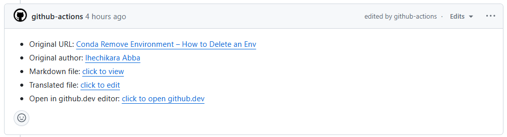

Click the link **click to open github.dev**. It will open the machine-translated file in the github.dev editor. It looks just like VS Code.
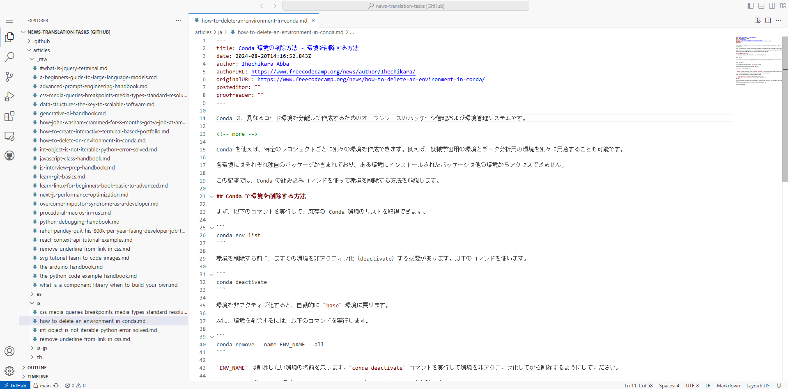

2. In the "posteditor" field at the beginning of the file, write your Ghost username.
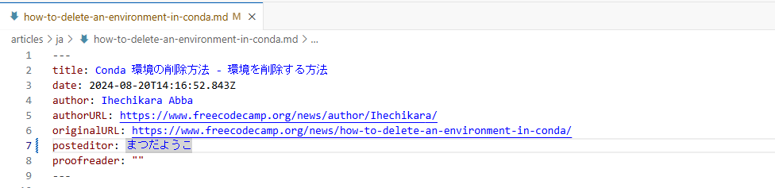

3. To see the original article in English, you can `Ctrl + click` the original URL to open the original article in your browser. Or you can find the original markdown file in the `articles/_raw` directory with the same file name. Be careful not to edit the raw file.

4. Go through the translated file and make changes, such as fixing mistranslations or improving awkward phrasing. This process of revising machine translation is called post-editing.

5. You can temporarily save your work with keyboard shortcut `Ctrl + S`. This way, the changes will be saved in your browser's local storage.

If you want to make sure you don't lose your work, it would be better to commit it. This will be explained in the next step.

### Commit your changes

When you are done with the post-editing, or you would like to save your changes so that you can resume your work later, you can commit your changes.

By committing and pushing, you can save your changes on GitHub.

1. In the left sidebar, click `Source Control` icon.
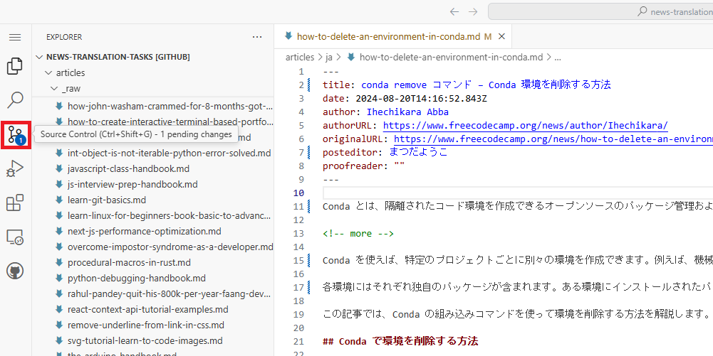

2. Click `+` next to the file you've changed to stage your changes.
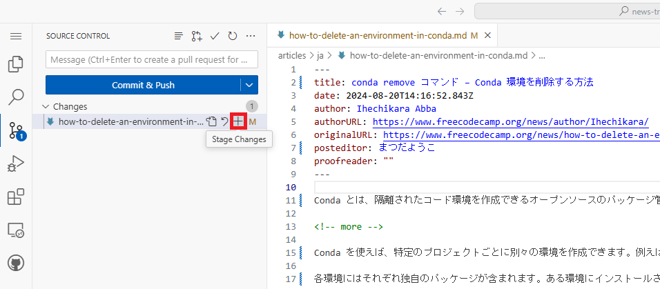

3. In the commit message, enter the translated title of the article. (If you make multiple commits, use a commit message that describes the change you've made.)
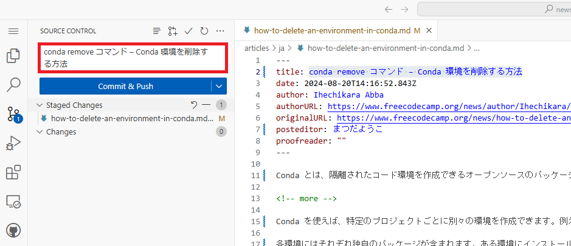

4. Click `Commit & Push`. 
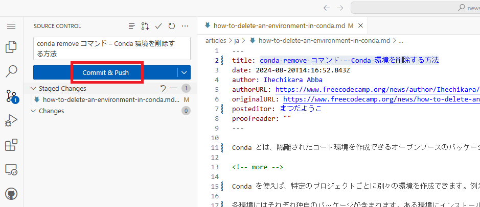

5. You will be prompted to name the new branch. It would be helpful to give it a short, descriptive name so that you can easily find it later. Press Enter to confirm.
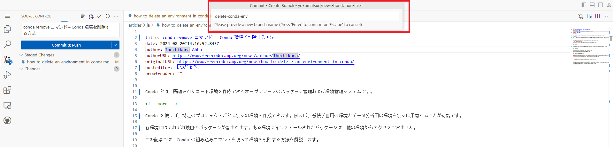

6. Your changes will automatically be pushed to your branch in your fork on GitHub. If the following pop-up appears, click `Switch to Fork`
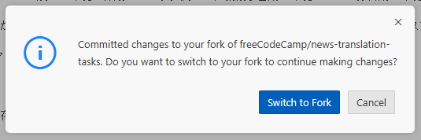

6. It will switch to the new branch you have just created, and you can continue working there. You can find the file you were working on in the Explorer.
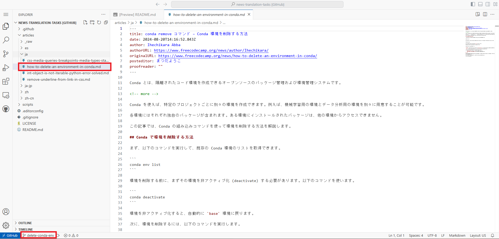

### Create a pull request

1. After you've finished post-editing the entire file and committed all the changes, click the branch name at the bottom and select `Open Branch on Github...`.
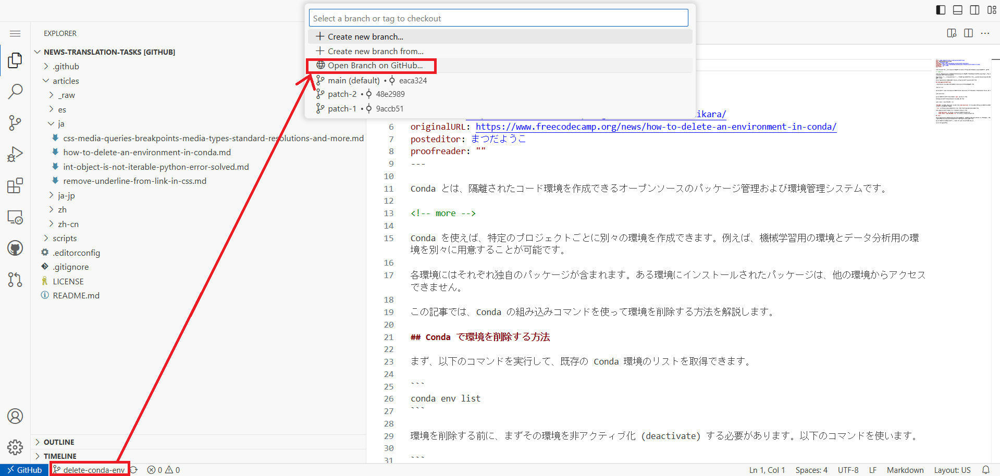

2. It will open your branch on github.com. Click `Compare & pull request` button.
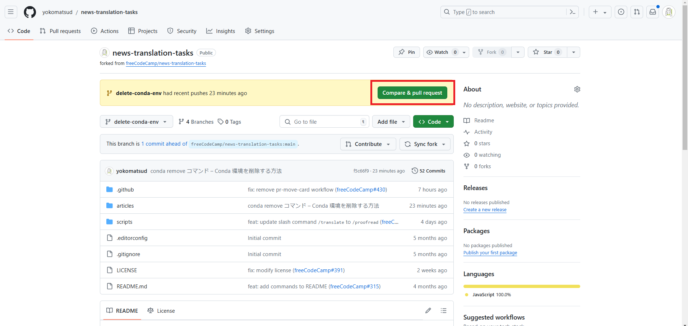

3. It will open the page to create a new pull request.

Check the following points:
- The base repository (on the left) should be `freeCodeCamp/news-translation-tasks` and the branch should be `main`
- The head repository (on the right) should be `[your username]/news-translation-tasks` and the branch should be `[your branch name]`
- The pull request title should be the translated title of the article
- Follow the checklist and put an x in each of the checkboxes
- Enter the issue number in `Closes #XXXXX` format.

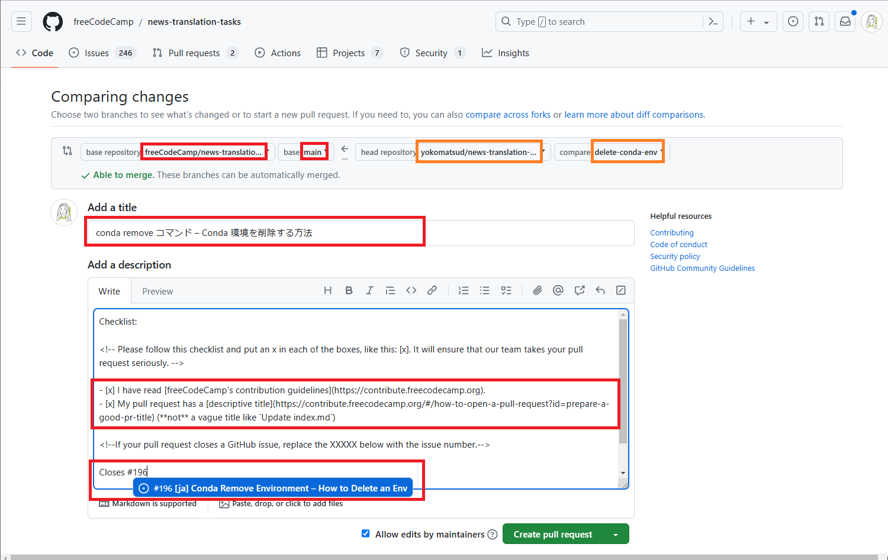

4. Click `Create pull request`. This will open the pull request and automatically notify the language lead.

Wait for the language lead to review your pull request. If you get feedback comments, make changes accordingly.

When the review is done, the language lead will merge your pull request.

5. Final Review and Publication Preparation

Once your pull request is merged, the language lead will take over the final steps. This includes a through final revision to ensure quality and consistency. The language lead will also handle the transfer of the content to our publication platform, complete with a thumbnail, slug, tags, and the link to the original English article.

**What is next ?** You are free to pick another translation and repeat the same process 1-4. 

Thank you ahead of time!

## Tips

### How to add a table of contents
Some articles have a table of contents. When you translate into languages that don't automatically convert to the English alphabet, such as Asian or Cyrillic languages, you may have to set the title and id manually.

For example:

```md
## Table of Contents

-   [Heading in your language](#heading-in-english)
-   [什么是记忆化](#what-is-memoization)
    -   [什么时候使用记忆化](#when-to-memoize)

<h2 id="heading-in-english">Heading in your language</h2>

<h2 id="what-is-memoization">什么是记忆化</h2>

<h3 id="when-to-memoize">什么时候使用记忆化</h3>
```

### How to add a caption to an image
To add a caption to an image in markdown, you can use the code like this:

```md
<figure class="kg-card kg-card-image kg-card-hascaption">
    
    <figcaption>Go extension in VSCode</figcaption>
</figure>
```
